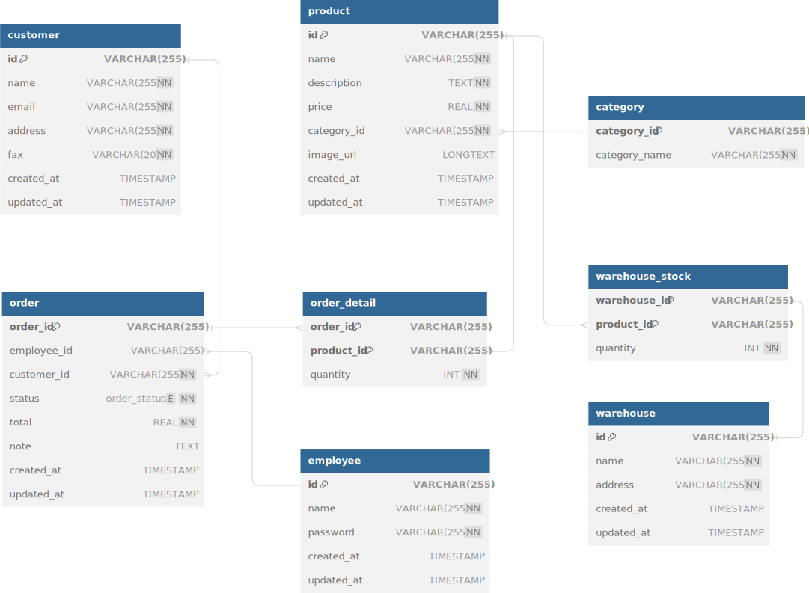

# Sale Dock
[](https://github.com/hardingadonis/saledock/actions/workflows/build.yml)
[](https://github.com/hardingadonis/saledock/actions/workflows/publish.yml)
[](https://github.com/hardingadonis/saledock/actions/workflows/release.yml)
[](https://www.codefactor.io/repository/github/hardingadonis/saledock)


> SWP391 project, ERP system, Sales module


## Requirements
- JDK 17
- MySQL 8.2.0
- Tomcat 10
- Maven 3+


## Database
<details>
  <summary>Database</summary>

  <div style="margin-top: 20px">
    <a href="https://github.com/hardingadonis/saledock">
      
    </a>
  </div>
</details>


## Development
- You need to install the requirements above.
#### 1. Clone `Sale Dock`:
```bash
git clone https://github.com/hardingadonis/saledock.git
```
#### 2. Open `Sale Dock`:
- You can open `Sale Dock` with your favorite IDE:
  - [IntelliJ IDEA](https://www.jetbrains.com/idea/)
  - [Eclipse](https://www.eclipse.org/)
  - [NetBeans](https://netbeans.apache.org/)
#### 3. Build `Sale Dock` with `Maven` (Optional):
```bash
cd saledock
mvn verify
```


## Deployment
#### 1. Download `docker-compose.yml`:
```bash
curl -O https://raw.githubusercontent.com/hardingadonis/saledock/main/docker-compose.yml
```
#### 2. Run `docker-copmose`:
```bash
docker-compose up -d
```
#### 3. Access `Sale Dock`:
- Open `http://localhost:8080/saledock` in your browser.


## Contributors

<!-- ALL-CONTRIBUTORS-LIST:START - Do not remove or modify this section -->
<!-- prettier-ignore-start -->
<!-- markdownlint-disable -->
<table>
  <tbody>
    <tr>
      <td align="center" valign="top" width="20%"><a href="https://github.com/hardingadonis"><br /><sub><b>Minh Vương</b></sub></a></td>
      <td align="center" valign="top" width="20%"><a href="https://github.com/bakaqc"><br /><sub><b>Đinh Quốc Chương</b></sub></a></td>
      <td align="center" valign="top" width="20%"><a href="https://github.com/htnghia1423"><br /><sub><b>Thunder</b></sub></a></td>
      <td align="center" valign="top" width="20%"><a href="https://github.com/yuhtnguyen"><br /><sub><b>Yuht</b></sub></a></td>
      <td align="center" valign="top" width="20%"><a href="https://github.com/linhlm0210"><br /><sub><b>linhlm0210</b></sub></a></td>
    </tr>
    <tr>
      <td align="center" valign="top" width="20%"><a href="https://github.com/thson58"><br /><sub><b>Nguyen Son</b></sub></a></td>
      <td align="center" valign="top" width="20%"><a href="https://allcontributors.org"><br /><sub><b>All Contributors</b></sub></a></td>
      <td align="center" valign="top" width="20%"><a href="https://imgbot.net"><br /><sub><b>Imgbot</b></sub></a></td>
      <td align="center" valign="top" width="20%"><a href="https://www.codefactor.io"><br /><sub><b>Automated code reviews</b></sub></a></td>
    </tr>
  </tbody>
  <tfoot>
    <tr>
      <td align="center" size="13px" colspan="5">
        
          <a href="https://all-contributors.js.org/docs/en/bot/usage">Add your contributions</a>
        </img>
      </td>
    </tr>
  </tfoot>
</table>

<!-- markdownlint-restore -->
<!-- prettier-ignore-end -->

<!-- ALL-CONTRIBUTORS-LIST:END -->


## Licenses:
- [Sale Dock](https://github.com/hardingadonis/saledock) is under the [Apache-2.0 license](https://github.com/hardingadonis/saledock/blob/main/LICENSE).
- [favicon](https://github.com/hardingadonis/saledock/blob/main/src/main/webapp/assets/images/favicon/favicon.png) is under the [flaticon](https://www.flaticon.com/free-icon/sale_791968).