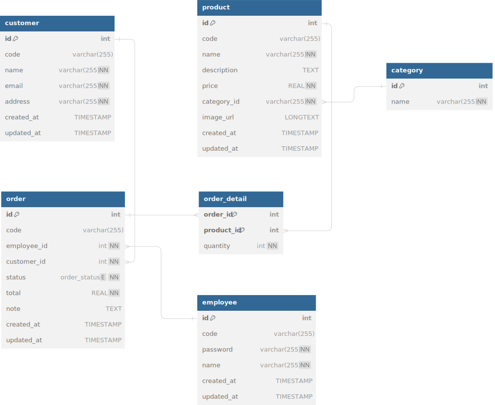

# Sale Dock
[](https://github.com/hardingadonis/saledock/actions/workflows/build.yml)
[](https://github.com/hardingadonis/saledock/actions/workflows/publish.yml)
[](https://github.com/hardingadonis/saledock/actions/workflows/release.yml)
[](https://www.codefactor.io/repository/github/hardingadonis/saledock)


> SWP391 project, ERP system, Sales module


## Requirements
- JDK 17
- MySQL 8.2.0
- Tomcat 10
- Maven 3+


## Database
<details>
  <summary>Database</summary>

  <div style="margin-top: 20px">
    <a href="https://github.com/hardingadonis/saledock">
      
    </a>
  </div>
</details>


## Development
- You need to install the requirements above.
#### 1. Clone `Sale Dock`:
```bash
git clone https://github.com/hardingadonis/saledock.git
```
#### 2. Open `Sale Dock`:
- You can open `Sale Dock` with your favorite IDE:
  - [IntelliJ IDEA](https://www.jetbrains.com/idea/)
  - [Eclipse](https://www.eclipse.org/)
  - [NetBeans](https://netbeans.apache.org/)
#### 3. Build `Sale Dock` with `Maven` (Optional):
```bash
cd saledock
mvn verify
```


## Deployment
#### 1. Download `docker-compose.yml`:
```bash
curl -O https://raw.githubusercontent.com/hardingadonis/saledock/main/docker-compose.yml
```
#### 2. Run `docker-copmose`:
```bash
docker-compose up -d
```
#### 3. Access `Sale Dock`:
- Open `http://localhost:8080/saledock` in your browser.


## Contributors

<!-- ALL-CONTRIBUTORS-LIST:START - Do not remove or modify this section -->
<!-- prettier-ignore-start -->
<!-- markdownlint-disable -->
<table>
  <tbody>
    <tr>
      <td align="center" valign="top" width="14.28%"><a href="https://github.com/hardingadonis"><br /><sub><b>Minh Vương</b></sub></a><br /><a href="#code-hardingadonis" title="Code">💻</a> <a href="#data-hardingadonis" title="Data">🔣</a> <a href="#doc-hardingadonis" title="Documentation">📖</a> <a href="#maintenance-hardingadonis" title="Maintenance">🚧</a> <a href="#review-hardingadonis" title="Reviewed Pull Requests">👀</a> <a href="#design-hardingadonis" title="Design">🎨</a></td>
      <td align="center" valign="top" width="14.28%"><a href="https://github.com/bakaqc"><br /><sub><b>Đinh Quốc Chương</b></sub></a><br /><a href="#code-bakaqc" title="Code">💻</a> <a href="#doc-bakaqc" title="Documentation">📖</a> <a href="#review-bakaqc" title="Reviewed Pull Requests">👀</a> <a href="#maintenance-bakaqc" title="Maintenance">🚧</a></td>
      <td align="center" valign="top" width="14.28%"><a href="https://github.com/htnghia1423"><br /><sub><b>Thunder</b></sub></a><br /><a href="#code-htnghia1423" title="Code">💻</a> <a href="#doc-htnghia1423" title="Documentation">📖</a> <a href="#review-htnghia1423" title="Reviewed Pull Requests">👀</a> <a href="#maintenance-htnghia1423" title="Maintenance">🚧</a></td>
      <td align="center" valign="top" width="14.28%"><a href="https://github.com/yuhtnguyen"><br /><sub><b>Yuht</b></sub></a><br /><a href="#code-yuhtnguyen" title="Code">💻</a> <a href="#doc-yuhtnguyen" title="Documentation">📖</a> <a href="#review-yuhtnguyen" title="Reviewed Pull Requests">👀</a></td>
    </tr>
  </tbody>
</table>

<!-- markdownlint-restore -->
<!-- prettier-ignore-end -->

<!-- ALL-CONTRIBUTORS-LIST:END -->


## Licenses:
- [Sale Dock](https://github.com/hardingadonis/saledock) is under the [Apache-2.0 license](https://github.com/hardingadonis/saledock/blob/main/LICENSE).