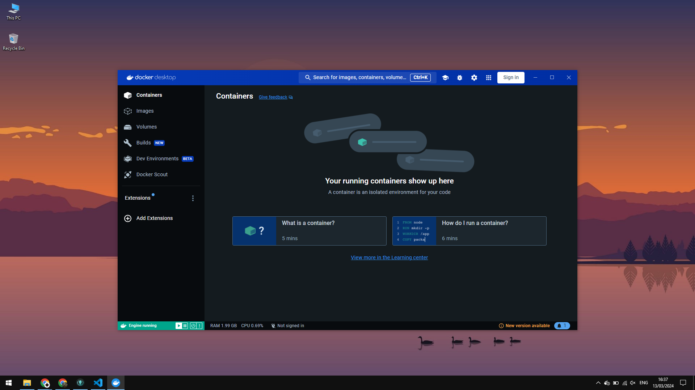
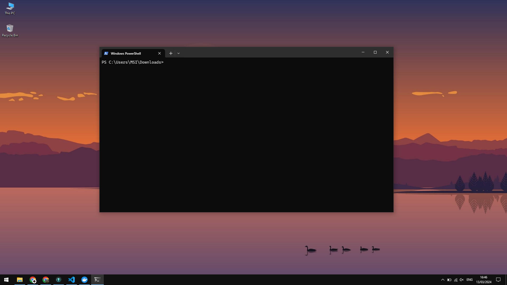
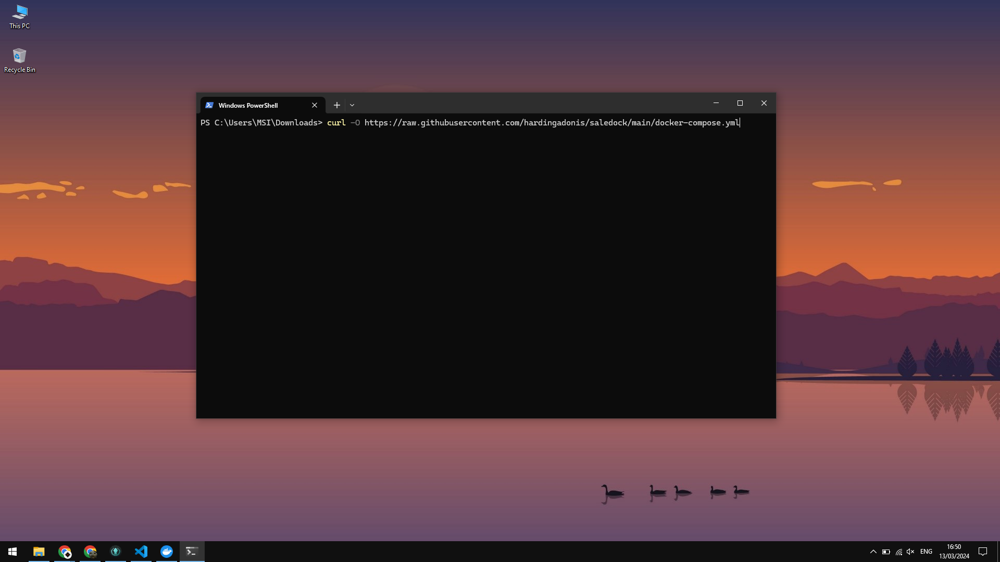
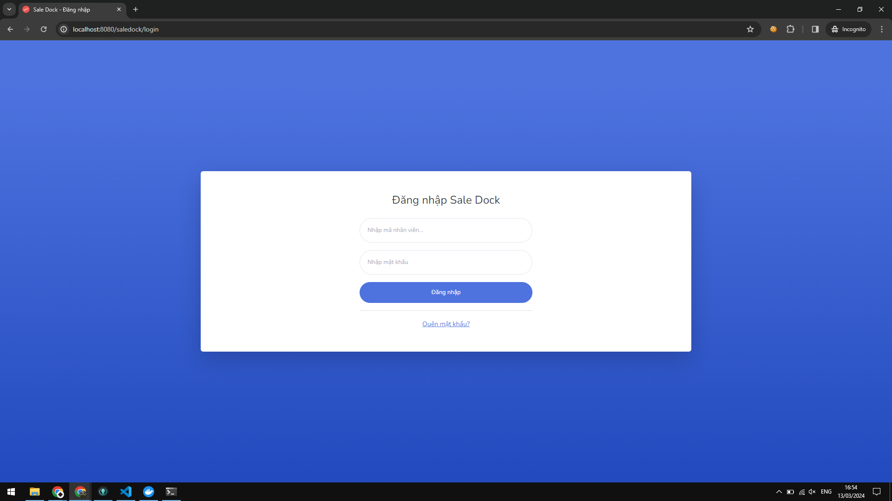

# Sale Dock - Installation Guide

## I. Install via Docker

### 1. Requirements

- OS: Linux, Windows, macOS
- Docker Desktop: [Install Docker Desktop](https://www.docker.com/products/docker-desktop)

### 2. Installation

- Step 1: Open Docker Desktop

  |  |
  | :------------------------------: |
  |  _Image 1: Open Docker Desktop_  |

- Step 2: Open your terminal

  |     |
  | :---------------------------: |
  | _Image 2: Open your terminal_ |

- Step 3: Download `docker-compose.yml` via `curl`

  ```bash
    curl -O https://raw.githubusercontent.com/hardingadonis/saledock/main/docker-compose.yml
  ```

  |       |
  | :-------------------------------------------------: |
  | _Image 3: Download `docker-compose.yml` via `curl`_ |

- Step 4: Run `docker-compose up -d` and wait for the installation to complete

  ```bash
    docker-compose up -d
  ```

  |   |
  | :-----------------------------------: |
  | _Image 4: Run `docker-compose up -d`_ |

- Step 5: Open your browser and navigate to `http://localhost:8080/saledock`

  |  |
  | :----------------------------: |
  |  _Image 5: Open your browser_  |
